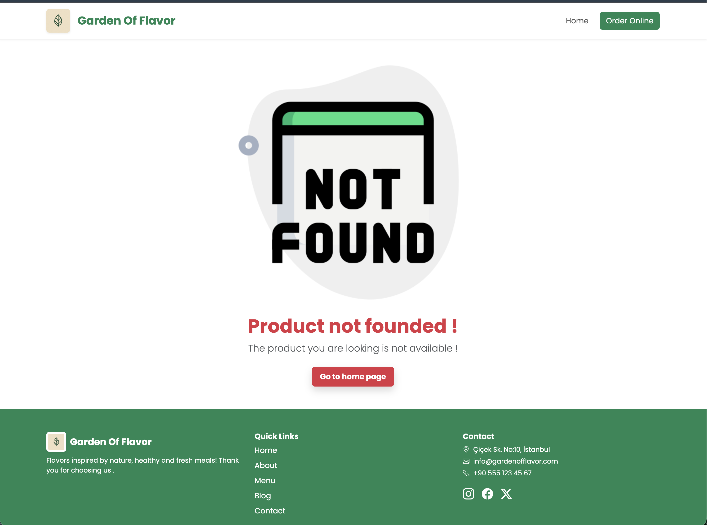
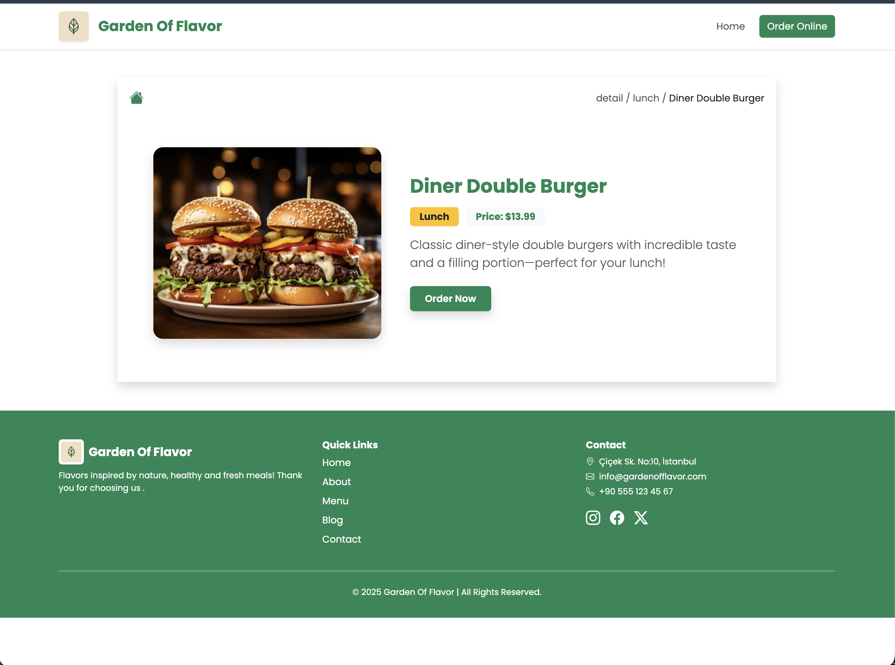

# 🍔 FoodApp

  

---

## 📌 Project Overview

**FoodApp** is a modern and responsive food discovery web application built using **HTML, CSS, and JavaScript**.

The application allows users to browse meals dynamically, view detailed pages, and interact with structured data in a clean UI environment.

This project focuses heavily on JavaScript logic, DOM manipulation, and data-driven rendering.

---

## 🚀 Technologies Used

- HTML5 – Semantic structure
- CSS3 – Responsive layout & modern UI styling
- JavaScript (Vanilla JS) – Core functionality
- JSON (db.json) – Data simulation

---

## 🧠 JavaScript Highlights

This project emphasizes JavaScript functionality including:

- Dynamic DOM rendering
- Fetching and handling local JSON data
- Page routing logic between `index.html` and `detail.html`
- Event listeners & interactive UI updates
- Clean and modular JS structure

The goal was to simulate a small-scale real-world frontend application workflow without using external frameworks.

---

## 🖼 Screenshots

### 🏠 Home Page

### 🍽 Food Grid

### 📋 Detail View

### 📱 Responsive Design

### 🖥 Fullscreen Preview

---

## 📂 Project Structure

  🎓 Teşekkür

Bu süreçte aldığım eğitimin kalitesi ve sistemli ilerleyişi benim için gerçekten belirleyici oldu.

Başta https://github.com/isveckrali olmak üzere, teknik disiplini, detaylara verdiği önem ve proje odaklı yaklaşımıyla gelişimime ciddi katkı sağladı. Sadece kod yazmayı değil, doğru düşünmeyi, doğru yapı kurmayı ve profesyonel bakış açısını öğrenmemde büyük payı var.

Ayrıca https://github.com/Udemig Eğitim Platformu’na da teşekkür ederim. Yapılandırılmış müfredatı, uygulama temelli ilerleyişi ve kariyer odaklı yaklaşımı sayesinde teoriyi pratiğe dönüştürme fırsatı buldum. Bu model, öğrenme sürecini sistemli ve sürdürülebilir hale getiriyor.

Emeği geçen herkese teşekkür ederim.

📬 Contact

📧 Mail: numanbalik72@gmail.com
💼 LinkedIn: https: http://linkedin.com/in/numan-balik-sverige
🐙 GitHub: https://github.com/numanbalik-web

